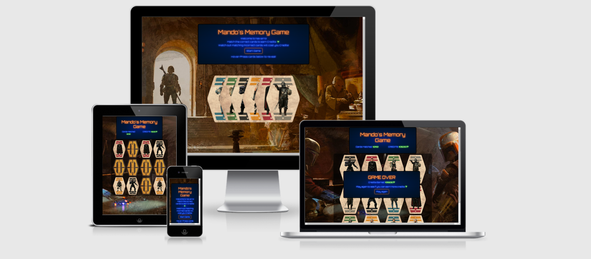
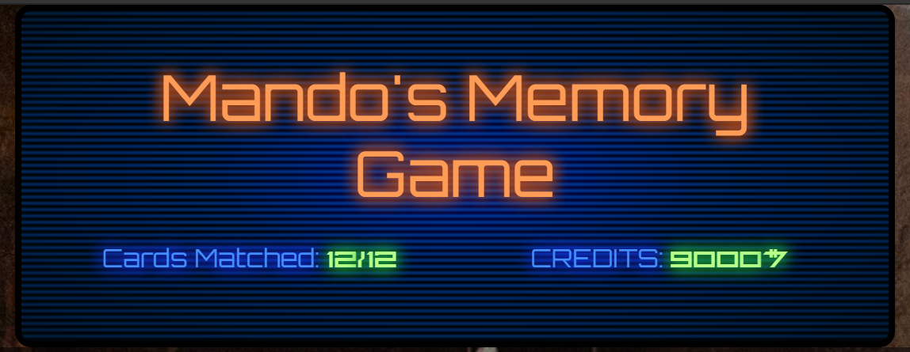

<h1 align="center">Star Wars Memory Game</h1>



[View the live project here.](https://connorsargent.github.io/MemoryGame/)

The primary goal of this project is to create a fun interactive memory game.

## User Experience (UX)

### User stories
#### First Time Visitor Goals
 1. As a First Time Visitor, I want to easily understand how to play the game.
 2. As a First Time Visitor, I want to be able to play and enjoy the game.

#### Returning Visitor/Frequent User Goals
 1. As a Returning Visitor, I want to try and improve previous scores.

### Design
#### Colour Scheme
 The colour scheme was chosen to look like devices used in star wars, using scan lines and a radial gradient behind the text to look like an old CRT screen this is lit from the center of the screen. The font colors are blue and orange with a text shadow to make the font appear as if it is glowing.

#### Typography
 The Orbitron font is the main font used throughout the whole website with Sans Serif as the fallback font in case for any reason the font isn't being imported into the site correctly. Orbitron is a clean and futuristic font, so it is both attractive and appropriate.
 The Aurebesh font is the font used for numbers and $ symbols throughout the website as this is a font from Star Wars with Sans Serif as the fallback font in case for any reason the font isn't being imported into the site correctly. 
 
 #### Imagery
 Imagery is important. The background image is designed to be immersive without distracting the user from the game. The cards used in the game are also designed to be immersive and ensuring they appear the same.
        

### Wireframes


#### Changes to wireframes
1. Added cards used in game to welcome page.
2. Added cards matched counter to score board.

### Languages Used

-   [HTML5](https://en.wikipedia.org/wiki/HTML5)
-   [CSS3](https://en.wikipedia.org/wiki/Cascading_Style_Sheets)
-   [JavaScript](https://en.wikipedia.org/wiki/javascript)

### Frameworks, Libraries & Programs Used

1. [Bootstrap 4.4.1:](https://getbootstrap.com/docs/4.4/getting-started/introduction/)
    - Bootstrap was used to assist with the responsiveness and styling of the website.
2. [Google Fonts:](https://fonts.google.com/)
    - Google fonts were used to import the 'Titillium Web' font into the style.css file which is used on all pages throughout the project.
3. [Git:](https://git-scm.com/)
    - Git was used for version control by utilizing the Gitpod terminal to commit to Git and Push to GitHub.
4. [GitHub:](https://github.com/)
    - GitHub is used to store the projects code after being pushed from Git.
5. [Figma:](https://figma.com/)
    - Figma was used to create the wireframes during the design process.
6. [Hover.css:](https://ianlunn.github.io/Hover/#licenses)
    - Hover.css was used for all the button grow animations.
7. [realfavicongenerator:](https://realfavicongenerator.net/)
    - realfavicongenerator was used to generate favicons for all devices.
8. [Autoprefixer CSS online](https://autoprefixer.github.io/)
    - plugin which parses your CSS and adds vendor prefixes

## Testing

The W3C Markup Validator and W3C CSS Validator Services were used to validate every page of the project to ensure there were no syntax errors in the project.

-   [W3C Markup Validator](https://validator.w3.org/#validate_by_input) 


-   [W3C CSS Validator](https://jigsaw.w3.org/css-validator/#validate_by_input)


JSHint was used to ensure there were no errors in the javascript files within the project.

-   [JSHint](https://jshint.com) 


When using JSHint to validate my code, I encountered a warning on line 47 "Expected an assignment or function call instead saw an expression." I think this is due to using a ternary operator as a if else statement, I originally did this because I thought it was cleaner and easier to follow but has now been changed to: 


### Lighthosue testing

#### Desktop


#### Mobile


### Testing User Stories from User Experience (UX) Section

-   #### First Time Visitor Goals

    1. As a First Time Visitor, I want to easily understand the main purpose of the site.

     

    2. Upon entering the site, users are automatically greeted with a clean and easily readable rules of the game. Underneath there is a "Start Game" Call to action button, which is highlighted with an orange boarder, when hovering over the button the button grows in size, the text color changes to orange and a shadow is applied to make the button appear to be glowing. (these effects apply to all buttons)

     

    3. Underneath the game rules users can also take a look at the cards they will have to match during the game, when hovering over the cards, the cards will rise slightly and push all the cards on the right of the chosen card to the right allowing the user to see the selected card clearly. This also creates the effect that the cards are physical and not just an image.

     

     4. Once the user has clicked the "Start Game" button, they will then be taken to the main game page. Upon entering the page the user will be presented with a score board that uses the same theme as the game rules and the game board in which the cards are displayed, highlighted by the translucent background.

     
     
     5. The score board contains the players realtime score and also the amount of cards out of 12 that have been matched correctly, So the user can track their progress as they play.

     

     6. The cards used in the game all have identical card backs to ensure the cards are not distinguishable. whilst the card faces are individual pairs and each contain a different character which should be identifiable on their own but on smaller devices they may not be as easily identified so the cards also have a corresponding color to help with this.

     7. When cards are flipped and a correct match is made the user will gain points/credits and also a bell will chime letting the user know that the match was correct.

     8. Upon a incorrect match the cards will display for a short period of time then return to there original position, allowing the user to see and attempt to remember the cards.

     

     

     9. When all 12 cards are match a sound will play and a message will be shown giving the player their final score, prompt the player to try again and a "play again" button. This lets the use know that the game is complete and gives the user an easy way to replay the game without having to return to the home page. clicking the button will refresh the game and the cards will return to a new random order.

     

      #### Returning/Frequent Visitor Goals

    1. As a Returning/Frequent Visitor, I want to attempt to beat my previous score. The scoring in the game rewards the player with 2000 points/credits for a successful card match but will also be punished for an incorrect match by loosing 500 points/credits. This gives the game replayability and gives the user a chance to play again and improve their score.

    


## Future Features

- I would like to implement a score table that tracks the users scores as they have played so that the user can track their progress I would also like the score table to keep a hi-score so the user can see their best attempt at the game.

## Deployment

### GitHub Pages

The project was deployed to GitHub Pages using the following steps...

1. Log in to GitHub and locate the [GitHub Repository](https://connorsargent.github.io/MemoryGame/)
2. At the top of the Repository (not top of page), locate the "Settings" Button on the menu.
    - Alternatively Click [Here](https://raw.githubusercontent.com/) for a GIF demonstrating the process starting from Step 2.
3. Scroll down the Settings page until you locate the "GitHub Pages" Section.
4. Under "Source", click the dropdown called "None" and select "Master Branch".
5. The page will automatically refresh.
6. Scroll back down through the page to locate the now published site [link](https://connorsargent.github.io/MemoryGame/) in the "GitHub Pages" section.

### Forking the GitHub Repository

By forking the GitHub Repository we make a copy of the original repository on our GitHub account to view and/or make changes without affecting the original repository by using the following steps...

1. Log in to GitHub and locate the [GitHub Repository](https://connorsargent.github.io/MemoryGame/)
2. At the top of the Repository (not top of page) just above the "Settings" Button on the menu, locate the "Fork" Button.
3. You should now have a copy of the original repository in your GitHub account.

### Making a Local Clone

1. Log in to GitHub and locate the [GitHub Repository](https://connorsargent.github.io/MemoryGame/)
2. Under the repository name, click "Clone or download".
3. To clone the repository using HTTPS, under "Clone with HTTPS", copy the link.
4. Open Git Bash
5. Change the current working directory to the location where you want the cloned directory to be made.
6. Type `git clone`, and then paste the URL you copied in Step 3.

```
$ git clone https://connorsargent.github.io/MemoryGame/
```

7. Press Enter. Your local clone will be created.

```
$ git clone https://connorsargent.github.io/MemoryGame/
> Cloning into `CI-Clone`...
> remote: Counting objects: 10, done.
> remote: Compressing objects: 100% (8/8), done.
> remove: Total 10 (delta 1), reused 10 (delta 1)
> Unpacking objects: 100% (10/10), done.
```

Click [Here](https://help.github.com/en/github/creating-cloning-and-archiving-repositories/cloning-a-repository#cloning-a-repository-to-github-desktop) to retrieve pictures for some of the buttons and more detailed explanations of the above process.

### Content

-   All content was written by the developer.


### Media

#### Fonts
davidocchino - [Aurebesh font](http://davidocchino.com/portfolio/typography/aurebesh.html)

#### Background
Ammonious - [Background Images](https://imgur.com/user/Ammonious)

#### Card Images
JonnieLP - [Sabbac Cards](https://www.therpf.com/forums/threads/star-wars-card-games-and-others.286020/page-11)

metropolis-hero1125 - [Character PNGs](https://www.deviantart.com/metropolis-hero1125)

edited by me in Photoshop.

#### Audio
DutchWilliam - [Bell](https://www.zedge.net/ringtone/bf627c2d-cfdd-4265-8664-ca20e025639f)

DarthObiwan - [This is the way](https://www.zedge.net/ringtone/29e3b692-927f-4cf4-aa34-5cc4a1813d23)

### Acknowledgements

-   My Mentor for continuous helpful feedback.

-   Tutor support at Code Institute for their support.

